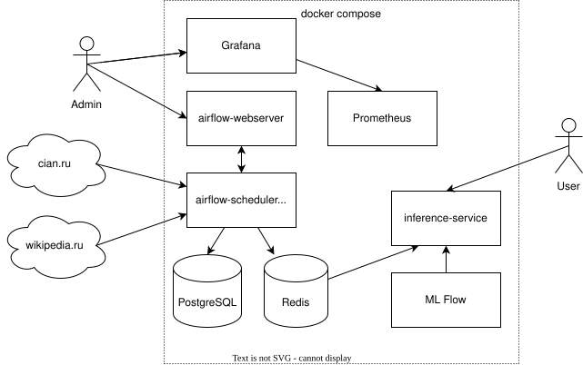
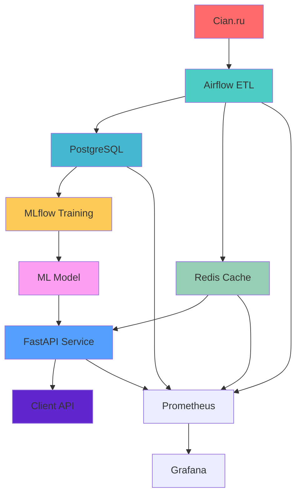

# Machine Learning Model Inference System

---

> **A comprehensive machine learning system for real estate data preprocessing with hot storage capabilities**

[](https://www.docker.com/)
[](https://airflow.apache.org/)
[](https://mlflow.org/)
[](https://fastapi.tiangolo.com/)
[](https://www.python.org/)

## Table of Contents

- [Overview](#overview)
- [Architecture](#architecture)
- [System Components](#system-components)
- [Prerequisites](#prerequisites)
- [Quick Start](#quick-start)
- [Configuration](#configuration)
- [Usage Examples](#usage-examples)
- [Monitoring](#monitoring)
- [Development](#development)
- [Project Structure](#project-structure)
- [Development Plans](#development-plans)
- [Contributing](#contributing)
- [Support](#support)

## Overview

A system implementing an architecture for the inference of machine learning models. It provides a universal template for model production and includes a production service for the model, Airflow for data collection and preprocessing, PostgreSQL and Redis for storing and efficiently delivering data to the model service, and monitoring tools - Prometheus and Grafana.

Currently, a demonstration model for predicting housing prices is available in the service.


## Architecture

The system follows a microservices architecture with clear separation of concerns:



### High-Level Data Flow



## System Components

| Component | Purpose | Port | Technology |
|-----------|---------|------|------------|
| **Airflow** | ETL Orchestration | 8080 | Apache Airflow |
| **MLflow** | ML Model Management | 5000 | MLflow |
| **FastAPI** | Prediction API | 5051 | FastAPI + Uvicorn |
| **PostgreSQL** | Primary Database | 5432 | PostgreSQL |
| **Redis** | Hot Storage Cache | 6379 | Redis |
| **Grafana** | Monitoring Dashboard | 3000 | Grafana |
| **Prometheus** | Metrics Collection | 9090 | Prometheus |

## Prerequisites

### System Requirements
- **OS**: Linux, macOS, or Windows (with WSL2)
- **RAM**: Minimum 8GB, Recommended 16GB+
- **Storage**: Minimum 20GB free space
- **CPU**: 4+ cores recommended

### Software Requirements
- **Docker**: Version 20.10+
- **Docker Compose**: Version 2.0+
- **Python**: Version 3.8+ (for local development)

### Network Requirements
- **Ports**: 3000, 5000, 5051, 5432, 6379, 8080, 8081, 9090, 9121, 9187
- **Internet**: Required for initial image downloads and data scraping

## Quick Start

### 1. Clone the Repository
```bash
git clone https://github.com/yourusername/ml-data-pipeline-storage.git
cd ml-data-pipeline-storage
```

### 2. Start All Services
```bash
# Start all services in detached mode
docker-compose up -d

# Check service status
docker-compose ps
```

### 3. Verify Installation
```bash
# Check if all services are running
curl http://localhost:5051/routes
```

### 4. Access Web Interfaces
- **Airflow**: http://localhost:8080 (admin/admin)
- **MLflow**: http://localhost:5000
- **Grafana**: http://localhost:3000 (admin/admin)
- **pgAdmin**: http://localhost:8081 (admin@admin.com/admin)

## Configuration

### Environment Variables

Create a `.env` file in the root directory:

```env
# Database Configuration
POSTGRES_DB=metastore
POSTGRES_USER=hive
POSTGRES_PASSWORD=hive

# Redis Configuration
REDIS_HOST=redis
REDIS_PORT=6379

# MLflow Configuration
MLFLOW_TRACKING_URI=http://mlflow:5000

# Service Configuration
SERVICE_PORT=5051
AIRFLOW_SECRET_KEY=your-secret-key
```

### Service Configuration

Each service can be configured through its respective configuration file:

- **Airflow**: `airflow/airflow.cfg`
- **MLflow**: Environment variables in `docker-compose.yml`
- **FastAPI**: `service/app/config.json`

## Usage Examples

### 1. Training a New Model

```bash
# Access MLflow container
docker exec -it mlflow bash

# Navigate to model directory
cd /mlflow/model

# Train XGBoost model
python train_XGBoost.py
```

### 2. Making Predictions via API

```python
import requests
import json

# API endpoint
url = "http://localhost:5051/process"

# Sample request data
request_data = {
    "request_id": "prediction_001",
    "features": {
        "okrug": "ЦАО",  # Central Administrative District
        "roomsCount": 2,
        "totalArea": 45.5,
        "floorNumber": 3,
        "floorsCount": 12,
        "ceilingHeight": 2.85,
        "cargoLiftsCount": 1,
        "houseMaterialType_brick": True,
        "houseMaterialType_monolith": False,
        "houseMaterialType_monolithBrick": False,
        "houseMaterialType_none": False,
        "houseMaterialType_panel": False
    }
}

# Make prediction request
response = requests.post(url, json=request_data)
result = response.json()

print(f"Predicted Price: {result['result']} RUB")
print(f"Status: {result['status']}")
```

### 3. Monitoring Pipeline Status

```bash
# Check Airflow DAG status
curl -u admin:admin http://localhost:8080/api/v1/dags

# Check service health
curl http://localhost:5051/health
```

## Monitoring

### Metrics Dashboard

The system provides comprehensive monitoring through Grafana dashboards:

- **Airflow DAG Performance**: Track ETL pipeline execution
- **API Response Times**: Monitor prediction service performance
- **Database Performance**: PostgreSQL query metrics
- **Cache Hit Rates**: Redis performance indicators
- **System Resources**: CPU, memory, and disk usage

### Alerting

Configure alerts in Grafana for:
- Pipeline failures
- High API response times
- Database connection issues
- Cache miss rates
- System resource thresholds

## Development

### Local Development Setup

```bash
# Clone repository
git clone <repository-url>
cd ml-data-pipeline-storage

# Create virtual environment
python -m venv venv
source venv/bin/activate  # On Windows: venv\Scripts\activate

# Install development dependencies
pip install -r requirements-dev.txt

# Run tests
pytest tests/
```

### Adding New Features

1. **New ML Models**: Add to `mlflow/model/` directory
2. **API Endpoints**: Extend `service/app/main.py`
3. **Data Pipelines**: Create new DAGs in `airflow/dags/`
4. **Monitoring**: Add custom metrics in Prometheus configuration

### Testing

```bash
# Run unit tests
pytest tests/unit/

# Run integration tests
pytest tests/integration/

# Run with coverage
pytest --cov=app tests/
```

## Project Structure

```
ml-data-pipeline-storage/
├── airflow/                    # Apache Airflow configuration
│   ├── dags/                  # ETL pipeline definitions
│   ├── modules/               # Custom Airflow modules
│   ├── Dockerfile             # Airflow container setup
│   └── requirements.txt       # Python dependencies
├── mlflow/                    # ML model management
│   ├── model/                 # Training scripts and data
│   ├── Dockerfile             # MLflow container setup
│   └── requirements.txt       # ML dependencies
├── monitoring/                # Observability stack
│   ├── grafana/              # Dashboard configurations
│   └── prometheus.yml         # Metrics collection config
├── service/                   # FastAPI prediction service
│   ├── app/                   # Application code
│   ├── tests/                 # Test suite
│   ├── Dockerfile             # Service container setup
│   └── requirements.txt       # Service dependencies
├── docker-compose.yml         # Service orchestration
└── README.md                  # This file
```

## Development Plans

### Current Status
The project is in active development with core infrastructure components implemented and operational.

### Roadmap

#### Phase 1: Core Infrastructure (Current)
- [x] Docker containerization setup
- [x] Airflow ETL pipeline framework
- [x] MLflow model management
- [x] FastAPI inference service
- [x] PostgreSQL and Redis integration
- [x] Monitoring with Prometheus and Grafana

#### Phase 2: Data Pipeline Enhancement (In Progress)
- [ ] Complete Cian.ru data extraction DAG
- [ ] Implement Wikipedia data extraction DAG
- [ ] Add data validation and quality checks
- [ ] Implement automated data freshness monitoring

#### Phase 3: Model Development (Planned)
- [ ] XGBoost model training pipeline
- [ ] Model versioning and A/B testing
- [ ] Automated model retraining
- [ ] Model performance monitoring

#### Phase 4: Production Readiness (Planned)
- [ ] CI/CD pipeline setup
- [ ] Comprehensive test coverage
- [ ] Security hardening
- [ ] Performance optimization
- [ ] Documentation completion

#### Phase 5: Advanced Features (Future)
- [ ] Multi-model support
- [ ] Real-time streaming data processing
- [ ] Advanced monitoring and alerting
- [ ] API rate limiting and authentication
- [ ] Multi-tenant support

### Contributing Guidelines

For detailed contribution guidelines, development setup, and project standards, please see [CONTRIBUTING.md](CONTRIBUTING.md).

### Quick Contribution Steps

1. **Fork** the repository
2. **Create** a feature branch (`git checkout -b feature/amazing-feature`)
3. **Commit** your changes (`git commit -m 'Add amazing feature'`)
4. **Push** to the branch (`git push origin feature/amazing-feature`)
5. **Open** a Pull Request

### Development Guidelines

- Follow PEP 8 style guidelines
- Add tests for new functionality
- Update documentation for API changes
- Ensure all tests pass before submitting PR
- Follow the project's TODO structure for task management

## Support

### Getting Help

- **Documentation**: Check this README and inline code comments
- **Issues**: Report bugs via GitHub Issues
- **Discussions**: Use GitHub Discussions for questions
- **Email**: Contact the maintainers directly

### Troubleshooting

Common issues and solutions:

1. **Port conflicts**: Ensure required ports are available
2. **Memory issues**: Increase Docker memory allocation
3. **Service startup failures**: Check Docker logs with `docker-compose logs`
4. **Database connection errors**: Verify PostgreSQL container is running

---

